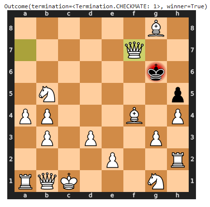

# Simple Python Chess Engine

A lightweight and modular chess engine built in Python using the `python-chess` library, demonstrating fundamental AI search algorithms for game play. The engine uses a modular `Player` class structure, allowing for easy testing and expansion of AI strategies.

## AI Engine and Algorithms

The core intelligence of this project resides in the application of the Minimax search algorithm.

### 1. Minimax Search with Alpha-Beta Pruning and Iterative Deepening

The primary engine is the **`MinimaxPlayer`**, which leverages the Minimax algorithm to determine the optimal move for a given search depth.

* **Alpha-Beta Pruning:** The search is dramatically accelerated by implementing Alpha-Beta Pruning, which efficiently prunes branches of the search tree that cannot possibly influence the final decision.
* **Configurable Depth:** The engine is initialized with a configurable search limit (`depth`), defaulting to **3** half-moves.
* **Iterative Deepening with Move Ordering:** The engine employs a form of Iterative Deepening Search (IDS). It incrementally searches from depth 1 up to the full configured depth. This allows the results from shallower searches to be used for **move ordering** in deeper searches, significantly improving the performance of the Alpha-Beta Pruning.

### 2. Static Board Evaluation

The **`BoardEvaluator`** class provides the static score for the terminal nodes of the search tree (or the non-terminal nodes at the search limit).

* **Material Value Function:** The evaluation is based purely on material advantage, summing the values of all pieces on the board.
* **Piece Values:**
    * King: 20,000
    * Queen: 900
    * Rook: 500
    * Bishop: 330
    * Knight: 320
    * Pawn: 100

---

## Player Implementations

The project defines an abstract **`Player`** class and includes several concrete implementations for testing and competition.

### Intelligent Player

* **`MinimaxPlayer
* 

